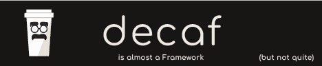

## Typescript Template


[](http://www.pdmfc.com)
[](https://github.com/decaf-ts/ts-workspace/actions?query=workflow%3ACodeQL)


Defaults to module, but exports to CommonJS and ESM.

With documentation, update and release mechanisms and gitlab/github workflows to match;

Defines a 'way' to write jsDocs to optimize the output

Optimized for github in terms of badges. CI is equivalent between Gitlab and Github.

Auto setup on first `npm install`

Will accept a `.token` file containing token valid for private npm dependencies, npm and docker registries

### ***Initial Setup***

#### if you use github

create a new project using this one as a template.

clone it `git clone <project>` and navigate to the root folder `cd <project>`

#### If your project has private dependencies or publishes to private npm registries, create an `.npmrc` containing:

```text
@<scope1>:registry=https://<ADDRESS>.com/api/v4/packages/npm/
@<scope2>:registry=https://<ADDRESS>.<DOMAIN>.com/api/v4/packages/npm/
//<ADDRESS>.<DOMAIN>.com/:_authToken=${TOKEN}
//<ADDRESS>.<DOMAIN>.com/api/v4/groups/<GROUP_ID>/packages/npm/:_authToken=${TOKEN}
//<ADDRESS>.<DOMAIN>.com/api/v4/projects/<PROJECT_ID>/packages/npm/:_authToken=${TOKEN}
```

Changing:
 - <ADDRESS> to `gitlab` or `github` (or other);
 - <DOMAIN> to your domain if any (if you are using plain gitlab or github use empty and take care to remove the extra `.`);
 - <GROUP_ID> to your project's group id (if any). otherwise remove this line
 - <PROJECT_ID> to your project's id

and adding a `.token` file containing your access token to the private registries na repositories.

### Installation

Run `npm install` (or `npm run do-install` if you have private dependencies and a `.token` file) to install the dependencies:

If this is the first time you are running this command it will also:
 - update this repository's dependencies to their latest version;
 - creates a `.token` file which you can leave empty unless you have private dependencies or publish to private registries
 - delete this 'first run script' file and npm call from the `package.json`;
 - try to commit the updated `package.json` and deleted files (having ssh access helps here);
## Linting

This repo comes with eslint + prettier preconfigured to the default standards
## Testing

Preconfigured Jest based testing:

- unit tests under the `tests/unit` folder;
  - include a default bundle test (helps with circular dependencies and such);
- integration tests under the `tests/integration` folder;
- stores converage results under `workdocs/coverage`;
- publishes coverage result to docs;
- ignores `cli.ts` from coverage since that is an executable file;
- defines the coverage threshold in `jest.config.ts`;
### Releases

This repository automates releases in the following manner:

- run `npm run release -- <major|minor|patch|version> <message>`:
  - if arguments are missing you will be prompted for them;
- it will run `npm run prepare-release` npm script;
- it will commit all changes;
- it will push the new tag;

If publishing to a private repo's npm registry, make sure you add to your `package.json`:

```json
{
  "publishConfig": {
    "<SCOPE>:registry": " https://<REGISTRY>/api/v4/projects/<PROJECT_ID>/packages/npm/"
  }
}
```

Where:

- `<SCOPE>` - Is the scope of your package;
- `<REGISTRY>` - your registry host;
- `<PROJECT_ID>` - you project ID number (easy to grab via UI in gitlab or by
  running `$("meta[name=octolytics-dimension-repository_id]").getAttribute('content')` in the repository page in github)
  ;

### Publishing

Unless the `-no-ci` flag is passed in the commit message to the `npm run release` command, publishing will be handled
automatically by github/gitlab (triggered by the tag).

When the `-no-ci` flag is passed then you can:

- run `npm run publish`. This command assumes :
  - you have previously run the `npm run release`;
  - you have you publishing properly configured in `npmrc` and `package.json`;
  - The token for any special access required is stored in the `.token` file;
 
## Continuous Integration/Deployment

While the implementationfor gitlab and github are not perfectly matched, they are perfectly usable.

The template comes with ci/cd for :
  - gitlab (with caching for performance):
    - stages: 
      - dependencies: Installs dependencies (on `package-lock.json` changes, caches node modules);
      - build: builds the code (on `src/*` changes, caches `lib` and `dist`);
      - test: tests the code (on `src/*`, `test/*` changes, caches `workdocs/{resources, badges, coverage}`);
      - deploy: 
        - deploys to package registry on a tag (public|private);
        - deploys docker image to docker registry (private);
        - Deploys the documentation to the repository pages;
  - github:
    - jest-test: standard `install -> build -> test` loop;
    - jest-coverage: extracts coverage from the tests;
    - codeql-analysis: Code quality analisys;
    - pages: builds the documentation and deploys to github pages
    - release-on-tag: issues a release when the tag does not contain `-no-ci` string
    - publish-on-release: publishes to package registry when the tag does not contain the `-no-ci` string
    - Requires Variables:
      - CONSECUTIVE_ACTION_TRIGGER: secret to enable actions to trigger other actions;
      - NPM_TOKEN: npm/docker registry token
## Considerations
 - Setup for a linux based environment (Sorry windows users. use WSL... or just change already);
 - Setup for node 20, but will work at least with 16;
 - Requires docker to build documentation (drawings and PlantUML)
## Documentation

The repository proposes a way to generate documentation that while still not ideal, produces verys consitest results.

In the code you see an example on how to properly document each code object, but the overall structure is:
  - each package is a `@module`;
  - Classes and Interfaces are categorized into `@category` and `@subcategory`;
  - All other objects are categorized by `@namespace` and `@memberOf`;
  - Enums and const are declared as `@const` and both must describe their properties as `@property` (when constants are objects);
  - Interfaces must declare their methods `@method`;

There are 3 steps the generating the documentation (automated in CI):
 - `npm run drawings` - generates png files from each drawing in the `workdocs/drawings` folder and moves them to the `workdocs/resources` folder (requires Docker);
 - `npm run uml` - generates png files from each PlantUML diagram in the `workdocs/uml` folder and moves them to the `workdocs/resources` folder (requires Docker);
 - `npm run docs` - this has several stages, defined under the `gulp docs` (gulpfile.js):
   - compiles the Readme file via md compile:
     - enables keeping separate files for sections that are then joined into a single file;
     - Allows keeping specific files in the jsdocs tutorial folder so they show up on their own menu;
   - compiles the documentation from the source code using jsdocs:
     - uses the better docs template with the category and component plugins
     - uses the mermaid jsdoc plugin to embue uml diagrams in the docs
     - includes a nav link to the test coverage results;
   - copies the jsdoc and mds to `/docs`;
   - copies the `./workdocs/{drawings, uml, assets, resources}` to `./docs`;

The produced `docs` folder contains the resulting documentation;
### Related

[](https://github.com/decaf-ts/ts-workspace)
### Social

[](https://www.linkedin.com/in/decaf-ts/)
### Scripts

The following npm scripts are available for development:

- `preinstall` - will run only on the first install to trigger the dep update. will self delete;
- `do-install` - sets a `TOKEN` environment variable to the contents of `.token` and runs npm install (useful when you
  have private dependencies);
- `flash-forward` - updates all dependencies. Take care, This may not be desirable is some cases;
- `reset` - updates all dependencies. Take care, This may not be desirable is some cases;
- `build` - builds the code (via gulp `gulpfile.js`) in development mode (generates `lib` and `dist` folder);
- `build:prod` - builds the code (via gulp `gulpfile.js`) in production mode (generates `lib` and `dist` folder);
- `test` - runs unit tests;
- `test:integration` - runs it tests;
- `test:all` - runs all tests;
- `lint` - runs es lint on the code folder;
- `lint-fix` - tries to auto-fix the code folder;
- `prepare-release` - defines the commands to run prior to a new tag (defaults to linting, building production code,
  running tests and documentation generation);
- `release` - triggers a new tag being pushed to master (via `./bin/tag_release.sh`);
- `clean-publish` - cleans the package.json for publishing;
- `coverage` - runs all test, calculates coverage and generates badges for readme;
- `drawings` - compiles all DrawIO `*.drawio` files in the `workdocs/drawings` folder to png and moves them to
  the `workdocs/resources` folder;
- `uml` - compiles all PlantUML `*.puml` files in the `workdocs/uml` folder to png and moves them to
  the `workdocs/resources` folder;
- `docs` - compiles all the coverage, drawings, uml, jsdocs and md docs into a readable web page under `./docs`;

### Repository Structure

```
ts-workspace
│
│   .gitignore              <-- Defines files ignored to git
│   .npmignore              <-- Defines files ignored by npm
│   .nmprc                  <-- Defines the Npm registry for this package
│   .eslintrc.cjs           <-- linting for the project
│   .prettier.config.cjs    <-- Code style for the project
│   .gitlab-ci.yml          <-- Gillab CI/CD file
│   gulpfile.js             <-- Gulp build scripts. used for building na other features (eg docs)
│   jest.config.ts          <-- Tests Configuration file
│   mdCompile.json          <-- md Documentation generation configuration file
│   jsdocs.json             <-- jsdoc Documentation generation configuration file
│   Dockerfile              <-- minimal example of a node service Dockerfile
│   LICENCE.md              <-- Licence disclamer
│   package.json
│   package-lock.json
│   README.md               <-- Readme File dynamically compiled from 'workdocs' via the 'docs' npm script
│   tsconfig.json           <-- Typescript config file. Is overriden in 'gulpfile.js' 
│
└───bin
│   │   tag_release.sh      <-- Script to help with releases
│   
└───docs
│   │   ...                 <-- Dinamically generated folder, containing the compiled documentation for this repository. generated via the 'docs' npm script
│   
└───src
│   │   ...                 <-- Source code for this repository
│   
└───tests
│   │───unit                <-- Unit tests
│   └───integration         <-- Integration tests
│   
└───workdocs                <-- Folder with all pre-compiled documentation
│   │───assets              <-- Documentation asset folder
│   │───badges              <-- Auto generated coverage badges folder
│   │───coverage            <-- Auto generated coverage results
│   │───drawings            <-- DrawIO folder. Drawings (*.drawio) here will be processed to generate documentation (requires docker)
│   │───uml                 <-- PlantUML folder. Diagrams (*.puml) here will be processed to generate documentation (requires docker)
│   │───tutorials           <-- Tutorial folder
│   │   ...                 <-- Categorized *.md files that are merged to generate the final readme (via md compile)
│   │   Readme.md           <-- Entry point to the README.md   
│  
└───dist
│   │   ...                 <-- Dinamically generated folder containing the bundles for distribution
│
└───lib
    |   ...                 <-- Dinamically generated folder containing the compiled code
```


## Getting help

If you have bug reports, questions or suggestions please [create a new issue](https://github.com/decaf-ts/ts-workspace/issues/new/choose).

## Contributing

I am grateful for any contributions made to this project. Please read [this](./workdocs/98-Contributing.md) to get started.

## Supporting

The first and easiest way you can support it is by [Contributing](./workdocs/98-Contributing.md). Even just finding a typo in the documentation is important.

Financial support is always welcome and helps keep the both me and the project alive and healthy.

So if you can, if this project in any way. either by learning something or simply by helping you save precious time, please consider donating.

## License

This project is released under the [MIT License](LICENSE.md).

#### Disclaimer:

badges found [here](https://dev.to/envoy_/150-badges-for-github-pnk), [here](https://github.com/alexandresanlim/Badges4-README.md-Profile#-social-) and [here](https://github.com/Ileriayo/markdown-badges)
